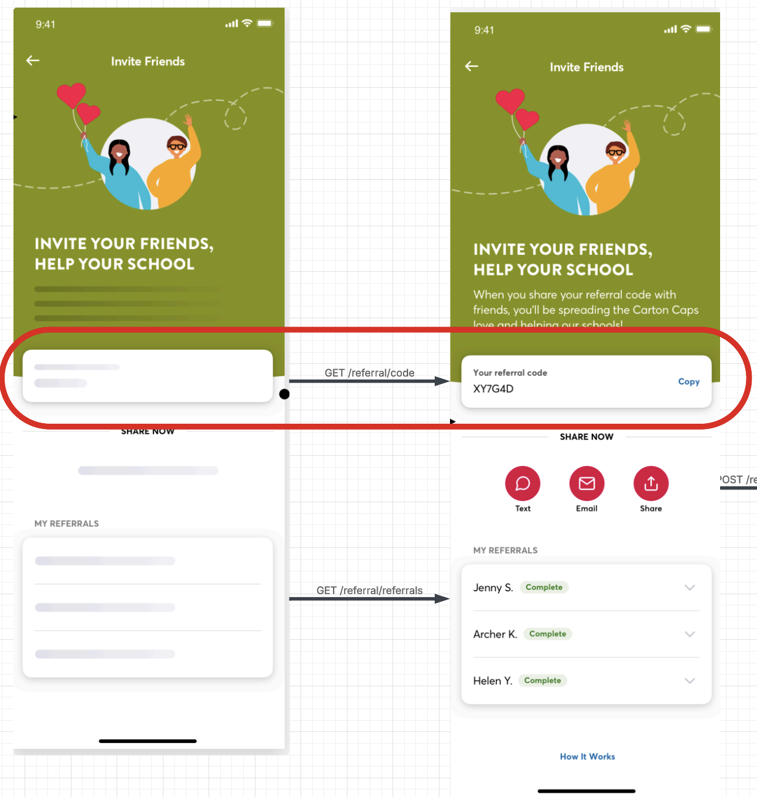

# Carton Caps - Referral Feature API Specification

## Requirements Overview

This document defines the REST API endpoints required to support the referral feature for the app. These endpoints serve as the interface between the frontend application and backend server. They account for functionality such as:

- Generating and retrieving a user’s referral code
- Generating referral links
- Tracking referral status

> Note: User authentication, profile retrieval (including referral code), new user registration, and referral code redemption during registration are **out of scope** and already handled by the existing API.

We assume deferred deep link support is handled by a third-party vendor (e.g., Firebase Dynamic Links).

---

## REST API Endpoints

### API Endpoint Table

| **Endpoint**                 | **Method** | **Purpose**                                        | **Called When**            |
| ---------------------------- | ---------- | -------------------------------------------------- | -------------------------- |
| `/api/v1/referral/code`      | GET        | Get the user’s referral code (generate if missing) | On referral page load      |
| `/api/v1/referral/referrals` | GET        | Get referred users and their statuses              | On referral dashboard view |
| `/api/v1/referral/link`      | POST       | Generate a Firebase Dynamic Link                   | On share button tap        |

---

### 1. `GET /api/v1/referral/code`

**Purpose:** Fetch the current user's referral code. If it does not exist, generate and persist a new one.


#### Request

- Headers: `Authorization: Bearer <token>`

#### Response

```json
{
  "code": "3A508B"
}
```

#### Errors

| Code | Description  |
| ---- | ------------ |
| 401  | Unauthorized |
| 500  | Server error |

---

### 2. `GET /api/v1/referral/referrals`

**Purpose:** List users that the current user has referred, with their statuses.


#### Request

- Headers:
  - `Authorization: Bearer <token>`
- **_For Testing Purposes:_**
  - Query: numReferrals
    - **How many generated referrals you want returned**

#### Response

```json
[
  {
    "id": "8c4344eb-220e-46ad-9019-a2282a145545",
    "refereeId": "1b8e4f8e-5c68-4d0b-8207-fc2addfca7dd",
    "refereeName": "Erwin S",
    "status": "Completed",
    "completedAt": "2025-03-30T00:13:26.1146796+00:00"
  },
  {
    "id": "408961c3-3961-41e1-ab53-b48a5f56528b",
    "refereeId": "01286468-8155-47ee-8d0c-8d877a336f01",
    "refereeName": "Rocky B",
    "status": "Completed",
    "completedAt": "2025-03-30T00:13:26.114686+00:00"
  }
]
```

#### Errors

| Code | Description  |
| ---- | ------------ |
| 401  | Unauthorized |
| 500  | Server error |

---

### 3. `POST /api/v1/referral/link`

**Purpose:** Generate a shareable referral link for the current user's referral code.


#### Request

- Headers: `Authorization: Bearer <token>`
- Body: Empty

#### Response

```json
{
  "link": "https://cartoncaps.link/abfilefa90p?referralCode=3A508B"
}
```

#### Errors

| Code | Description             |
| ---- | ----------------------- |
| 401  | Unauthorized            |
| 500  | Could not generate link |

---

## Data Structures

### `Referral_Codes`

Stores referral codes owned by users. Each code is globally unique.

| Column     | Type      | Description                                    |
| ---------- | --------- | ---------------------------------------------- |
| id         | UUID / PK | Unique identifier                              |
| user_id    | UUID      | Refers to the user who owns the code (indexed) |
| code       | VARCHAR   | Unique referral code (indexed, unique)         |
| created_at | TIMESTAMP | Time of creation                               |

---

### `Referrals`

Tracks which users have signed up using a referral code.

| Column           | Type        | Description                                   |
| ---------------- | ----------- | --------------------------------------------- |
| id               | UUID / PK   | Unique identifier for the referral            |
| referral_code_id | UUID        | Foreign key to Referral_Codes table (indexed) |
| referee_id       | UUID        | User who used the referral code               |
| status           | ENUM/String | Status of referral (e.g., pending, complete)  |
| created_dt       | TIMESTAMP   | Date/time referral was created                |
| completed_dt     | TIMESTAMP   | Date/time referral was completed              |

---

## Abuse Mitigation Considerations

To reduce the risk of referral fraud:

- **Track referral metadata** such as IP address, device ID, and user agent.
- **Delay rewards** until referral conditions are met (e.g., verification, activity thresholds).
- **Prevent self-referrals** by checking for matching device, email, or IP.
- **Limit referrals from the same IP/device** over a short time span.
- **Introduce manual review for flagged referrals.**

These additions may require updates to the `Referrals` table, such as:

```text
referee_ip VARCHAR
referee_device_id VARCHAR
is_flagged BOOLEAN
flag_reason TEXT
verified_at TIMESTAMP
reward_eligible_at TIMESTAMP
```

---
