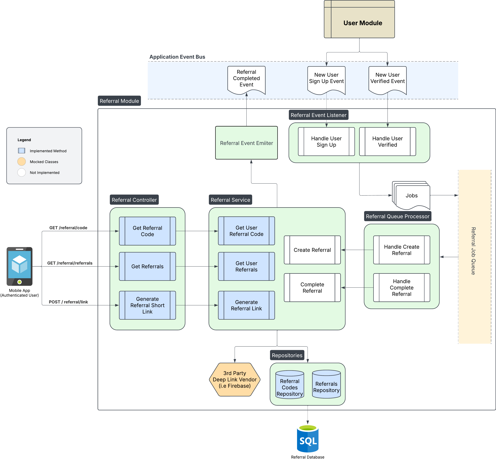

# Carton Caps - Referral Feature System Design

This diagram illustrates a possible system design for implementing a Referral Feature.

The system supports generating referral codes, tracking referrals, and processing them based on user actions. It is designed to respond to events from the User Module, such as:

🌟 User Sign Up

✅ User Verified

These events trigger the referral creation and completion workflows. Once a referral is completed, a Referral Completed event is emitted — this can be consumed by other systems, such as a Rewards Module, to issue bonuses or incentives.

